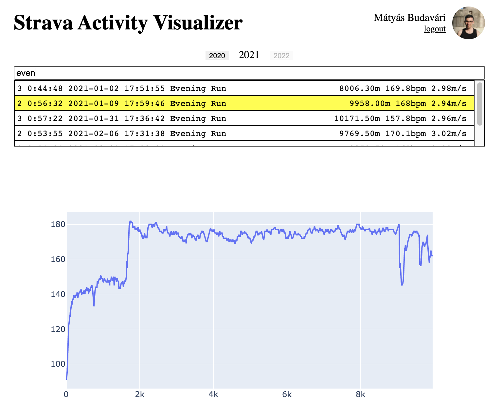
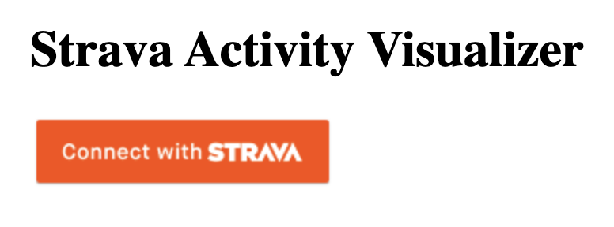
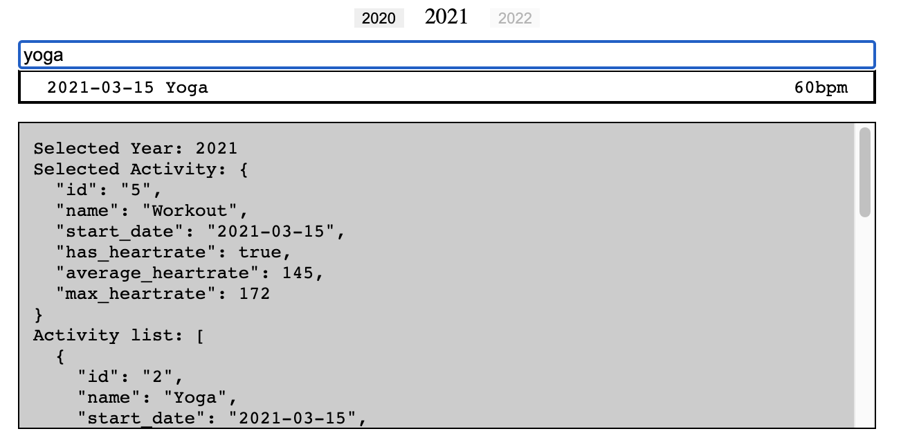

# activity-visualizer

Plotly app to visualize activities in Strava deployed to Heroku

See the whole app live on [heroku](https://activity-visualizer.herokuapp.com/).
It needs a strava account, and some activity to look at.



<!--  -->

See the custom component's demo page in action,
(what a programmer would see during development) on
[github-pages](https://budavariam.github.io/activity-visualizer/).



## Getting started

Set env variables to `/.env` from project dir.

```conf
STRAVA_SECRET=xxxxxxxxxxxxxxxxxxxxxxxxxxxxxxxxxxxxx
STRAVA_REFRESH=xxxxxxxxxxxxxxxxxxxxxxxxxxxxxxxxxxx 
STRAVA_CLIENT=xxxxxxx
APP_URL=http://localhost:5000/
```

```bash
cd src
python3 -m venv venv
. ./venv/bin/activate
python3 app.py
```

## Interesting pages

- [Strava connection](https://github.com/AartGoossens/strava-dash-boilerplate)
- [Dash docs](https://plotly.com/python/getting-started/)
- [Strava playground](https://developers.strava.com/playground/#/Activities/getLoggedInAthleteActivities)
- [strarvalib](https://pythonhosted.org/stravalib/)

## Base requirements

- stravalib
- dash
- plotly
- gunicorn

## Develop plugin alongside code

- run `npm start` from activity_selector
- run vscode debug mode for server in a different shell
- sometimes run `npm run sdist:activated` to install new prod version as seen below

```bash
pushd activity_selector
npm run sdist:activated # create prod build 
popd
pushd src
. ./venv/bin/activate
pip install -e ../activity_selector
```

## Deploy to Heroku

Set env variables as Config vars.

```bash
heroku login
git push heroku main
heroku logs --tail 
```

## Common errors

- `Exception has occurred: SyntaxError expression cannot contain assignment, perhaps you meant "=="?`, you most probably missed a comma at the end of a line in the layout.
- `No module named 'layout'`, most probably gunicorn config can not see the folder properly. needs a `--chdir ./src` prop to set the root